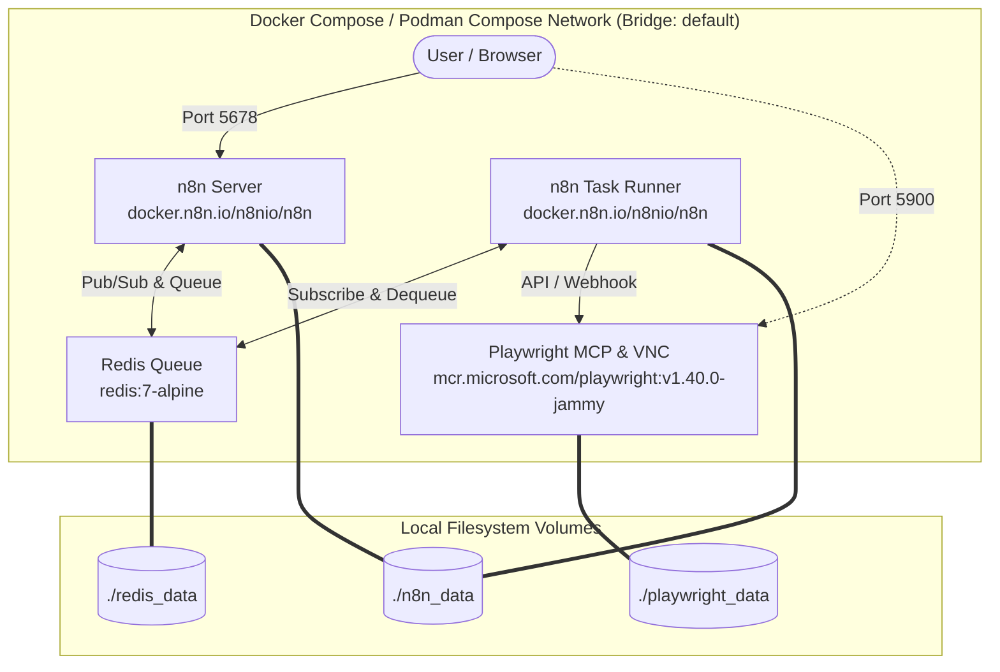

# Docker Compose Modularization 技術設計書

## 1. 概要

本設計書では、現在単一で運用されている（一部実験的に分離されている）Docker Composeの構成を、機能単位の独立したコンテナ群（n8n Server、n8n Task Runner、Playwright MCP、VNC、Redis）へとモジュール化するアーキテクチャ設計を示します。公式イメージの活用を徹底することで、保守性とセキュリティの向上を図ります。

## 2. アーキテクチャパターンと境界マップ

### 2.1 システム構成図

### 2.2 サービス境界
*   **n8n Server (メインアプリケーション)**: ユーザーインターフェースの提供、ワークフローの設計管理、トリガーの受信とワークフロー実行のスケジューリング（Redisへのジョブ投入）。
*   **n8n Task Runner (ワーカー)**: Redisからジョブを取得し、実際のワークフローロジックの実行、外部サービス（Playwright MCPなど）との通信を行う。
*   **Redis**: n8n ServerとTask Runner間のジョブキュー管理、状態の共有。
*   **Playwright MCP (VNC内蔵)**: ブラウザ自動化機能を提供するエンドポイント。コンテナに内蔵されているVNCサーバーを利用し、GUI操作の可視化・デバッグも単一サービスで担う。

## 3. テクノロジースタックと整合性

### 3.1 使用技術
*   **オーケストレーション**: Podman Compose (Docker Compose互換)
*   **n8n Server / Runner**: `docker.n8n.io/n8nio/n8n` (同一イメージを使用し、環境変数またはコマンドで振る舞いを変更)
*   **メッセージキュー**: `redis:7-alpine`
*   **ブラウザ自動化**: `mcr.microsoft.com/playwright:v1.40.0-jammy` (※Alpineは非サポートのためUbuntu jammyを採用)
*   **ネットワーク**: Docker内部ブリッジネットワーク (ポートは必要最小限のみホストに公開)

### 3.2 現行システムとの整合性
*   `.env` ファイルによる既存の環境変数管理は継続。
*   ローカルフォルダ (`./n8n_data`, `./playwright_data`) をボリュームとしてマウントし、現在保存されているワークフローや認証情報をそのまま引き継ぐ。
*   PlaywrightのVNC可視化については、Playwright公式コンテナのビルトインVNC機能を活用することでサービス集約と簡素化を図る。

## 4. 要件トレーサビリティ

*   **1.1 n8nサービス**: n8nコンテナとして定義。ポート`5678`を公開し、`./n8n_data`をマウント。
*   **1.2 n8n Task RunnerサービスとRedis**: Task RunnerコンテナとRedisコンテナを定義。Redisを介して実行をルーティング。
*   **1.3 Playwright MCP と VNC サービス**: Playwrightコンテナとして定義。ポート`3000`（または設定済の`8931`等）を内部向けとし、デバッグ用VNC（例: `5900`等）を公開、`./playwright_data`をマウント。
*   **2.1 イメージソース**: `docker.n8n.io/n8nio/n8n`, `redis:7-alpine`, `mcr.microsoft.com/playwright:v1.40.0-jammy`を使用。（Task Runnerもn8n公式イメージを使用）
*   **2.2 コミュニティノード対応**: 必要に応じ起動スクリプトやカスタムビルドで対応可能にする。
*   **3.1 メンテナンス性**: 各サービスのイメージタグを`docker-compose.yml`で独立管理。環境変数もサービスごとに分離。
*   **3.2 セキュリティ**: `n8n`(`5678`)と`VNC`(`5900`)のみ公開。内部通信用ネットワークを構築。
*   **3.3 互換性**: 既存の`n8n_data`を使用、`.env`をサポート、`podman compose`互換を維持。

## 5. コンポーネントとインターフェース契約

### 5.1 n8n Server (メインアプリケーション)
*   **イメージ**: `docker.n8n.io/n8nio/n8n`
*   **インターフェース**: ホストへポート `5678` を公開。
*   **主な環境変数**:
    *   `EXECUTIONS_MODE=queue` (Queue modeを有効化)
    *   `QUEUE_BULL_REDIS_HOST=redis`
    *   `QUEUE_BULL_REDIS_PORT=6379`
    *   `QUEUE_BULL_REDIS_PASSWORD` (必要に応じて)
*   **マウント**: `./n8n_data:/home/node/.n8n`

### 5.2 n8n Task Runner (ワーカー)
*   **イメージ**: `docker.n8n.io/n8nio/n8n`
*   **起動コマンド**: `n8n worker` (メインプロセスとは異なる起動コマンド)
*   **インターフェース**: 外部へのポート公開はなし。
*   **主な環境変数**:
    *   `EXECUTIONS_MODE=queue`
    *   `QUEUE_BULL_REDIS_HOST=redis`
    *   `QUEUE_BULL_REDIS_PORT=6379`
    *   `QUEUE_BULL_REDIS_PASSWORD`
*   **マウント**: `./n8n_data:/home/node/.n8n` (サーバーと共有、または同期機構を利用)

### 5.3 Redis Queue
*   **イメージ**: `redis:7-alpine`
*   **インターフェース**: 内部ネットワーク内でポート `6379`。外部へは公開しない。
*   **設定**: AOF (Append Only File) などの永続化オプションの有効化が推奨される。
*   **マウント**: `./redis_data:/data`

### 5.4 Playwright MCP & VNC Service
*   **イメージ**: `mcr.microsoft.com/playwright:v1.40.0-jammy`
*   **インターフェース**:
    *   MCP用ポート（例:`8931`や`3000`）を内部ネットワークで公開。
    *   VNC/noVNC用ポート（例:`5900` または `8080`）をホストマシンへ公開（デバッグ目的）。
*   **マウント**: `./playwright_data:/home/pwuser/user-data` (またはアプリケーションに応じたパス)

## 6. セキュリティとネットワーク設計
*   すべてのコンテナは共通の内部ブリッジネットワーク（例:`n8n-net`）に接続する。
*   外部からのアクセスは、n8nのUI用ポート（`5678`）とデバッグ用VNCポート（`5900`）のみに制限し、Playwright MCPポートやRedisポートはホストマシンにマッピングしない。

## 7. 環境変数管理戦略
環境変数は、その性質に応じて以下のように管理場所を分離する。

*   **`.env` ファイルで管理する情報**:
    *   **機密情報**: `N8N_ENCRYPTION_KEY` などのパスワードやシークレット
    *   **ユーザー固有の情報**: `TZ` (タイムゾーン) や `N8N_COMMUNITY_PACKAGES` などの各環境で変化しうる設定
*   **`docker-compose.yml` 内に直接（ハードコードで）定義する情報**:
    *   `N8N_RUNNERS_MODE` や内部ルーティング先URL (`N8N_RUNNERS_CONNECT_TO_URL`) など、アーキテクチャの構造上固定される設定値。これにより設定ファイルのポータビリティを向上させる。