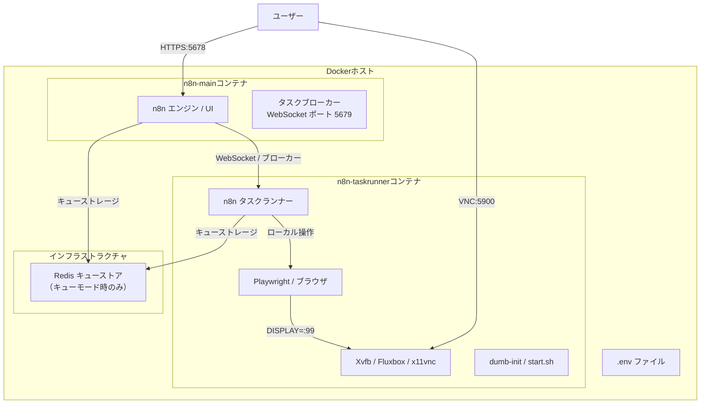
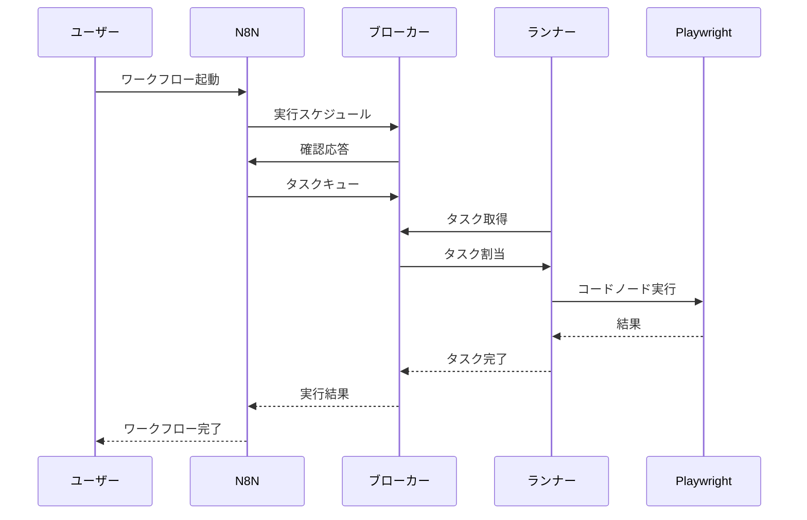
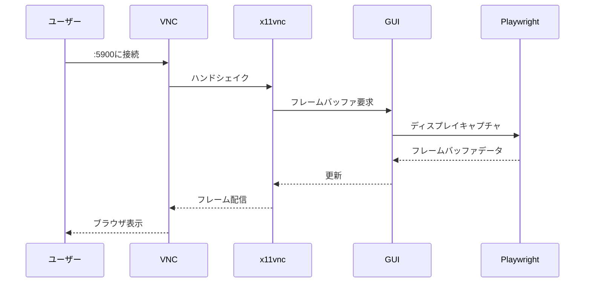

# 設計書：n8n-playwright-vnc-docker

## 概要

この設計書は、n8nのExternal Task Runnerモードを採用し、n8n本体と実行環境（Playwright/VNC）を分離したDocker構成を定義します。Playwrightによるブラウザ操作とVNCによる可視化をTask Runnerコンテナに統合することで、システムの安定性とデバッグしやすさを両立します。

### 目標
- n8n公式のExternal Task Runner Patternに準拠したアーキテクチャ構築 (1.1)
- Playwright v1.51.1-jammyをベースにしたTask Runnerイメージの作成 (1.2, 3.1)
- Node.js 22.x 環境での実行 (2.3)
- RedisをQueueストアとして適切に配置 (2.2)
- VNCによるGUI操作の可視化 (4.1)

### 対象外
- 外部データベース（PostgreSQL等）への移行（現状はSQLiteを維持）
- 複数のTask Runnerによる水平スケーリングの詳細設計

---

## アーキテクチャ

### 既存アーキテクチャの分析

現行のDocker Compose構成では以下の問題が特定されました：

1. **Redisの役割の誤認識**：Task RunnerとRedis間の接続が誤って記述されており、実際にはTask Runnerはn8n-mainのTask BrokerにWebSocketで直接接続する
2. **環境変数の漏れ**：`N8N_RUNNERS_ENABLED`、`N8N_RUNNERS_AUTH_TOKEN`、`N8N_RUNNERS_TASK_BROKER_URI` が記載不足
3. **Playwrightバージョンの陳腐化**：v1.40.0が使用されており、セキュリティリスクあり

### アーキテクチャパターンと境界マップ



**アーキテクチャ統合方針**：
- **採用パターン**：External Task Runner Pattern（サイドカーモデル）
- **ドメイン境界**：
  - n8n-main：ユーザーインターフェース、ワークフロー管理、トリガー実行
  - n8n-taskrunner：Codeノード実行、Playwright制御、GUI表示
- **実装方針**：Playwright v1.51.1-jammy をベースに、公式の `n8nio/runners` 相当の機能を統合

### 技術スタック

| レイヤー | 選択 / バージョン | 役割 | 備考 |
|--------|----------------|------|------|
| ランタイム | Node.js 22.x | エンジン実行 | main・Runner 両方で使用 |
| オーケストレーション | Docker Compose | サービス管理 | External Task Runner 対応 |
| タスクブローカー | n8n Main | WebSocketによるタスク配信 | ポート 5679 |
| キューストア | Redis 7-alpine | Bullキューの永続化 | Task Requester ↔ Worker |
| ブラウザ | Playwright 1.51.1 | ブラウザ自動化 | Jammyベースイメージ |
| GUI環境 | Xvfb / Fluxbox | 仮想ディスプレイ | Task Runner 内で動作 |
| VNCサーバー | x11vnc | リモート可視化 | ポート 5900 |

### システムフロー

#### タスク実行フロー



#### VNC可視化フロー



---

## 要件トレーサビリティ

| 要件ID | 概要 | 対象コンポーネント | インターフェース | フロー |
|--------|------|-----------------|----------------|-------|
| 1.1 | 最小限のDocker環境の構成 | n8n-main, n8n-taskrunner, Redis | Docker Compose | デプロイ |
| 1.2 | シングルステージDockerビルド | 統合Task Runner Dockerfile | ビルドコンテキスト | ビルド |
| 1.3 | .envによる設定管理 | 環境変数 | 設定読み込み | ランタイム |
| 1.4 | Docker volumeによる永続化 | n8n_data, playwright_data | ボリュームマウント | 永続化 |
| 2.1 | n8n Webアクセス | n8n-main | ポート 5678 | UIアクセス |
| 2.2 | n8n-Playwright連携 | n8n-taskrunner | WebSocket | 実行 |
| 2.3 | Node.js 22.x | NodeSourceセットアップ | コンテナビルド | ランタイム |
| 2.4 | 自動再起動 | restart: unless-stopped | Docker healthcheck | 信頼性 |
| 3.1 | Playwright実行環境 | n8n-taskrunner | Code Node API | ワークフロー実行 |
| 3.2 | Headed/Headlessモード | DISPLAY=:99 | Xvfb | ブラウザ |
| 3.3 | スクリーンキャプチャ | Playwright API | 内部 | デバッグ |
| 4.1 | VNC可視化 | n8n-taskrunner (GUI) | ポート 5900 | リモートビュー |
| 4.2 | Headedモード表示 | x11vnc + Fluxbox | ディスプレイ :99 | モニタリング |
| 4.3 | リアルタイム表示 | x11vnc | フレームバッファ | ストリーミング |

---

## コンポーネントとインターフェース

### [n8n-mainコンテナ]

| 項目 | 詳細 |
|------|------|
| 目的 | ワークフロー管理、UI、トリガー実行を担うメインプロセス |
| 対応要件 | 1.1, 2.1, 2.3, 2.4 |
| 重要度 | P0 - コアサービス |

**責務と制約**
- ユーザーインターフェースの提供（ポート5678）
- ワークフローのスケジュール管理とトリガー実行
- Task BrokerとしてTask Requesterからのリクエストを処理
- Redisへのタスクキュー投入
- Task RunnerからのWebSocket接続受け入れ

**依存関係**
- インバウンド：ユーザー (P0)、n8n-taskrunner (P1 - WebSocket)
- アウトバウンド：Redis (P0 - キューストレージ)、n8n-taskrunner (P1 - タスク配信)

**契約**：サービス [X] / API [X] / 状態 [ ]

#### サービスインターフェース

> **注**：以下のTypeScriptインターフェースは、ドキュメント用の概念的な責任範囲の表現であり、実際の実装インターフェースではありません。

```typescript
interface N8NMainService {
  // タスクブローカーインターフェース
  startBroker(): Promise<void>;
  stopBroker(): Promise<void>;

  // タスクリクエスタインターフェース
  queueTask(workflow: Workflow, inputs: InputData): Promise<TaskId>;

  // 実行結果ハンドラ
  handleExecutionResult(taskId: TaskId, result: ExecutionResult): Promise<void>;
}
```

- **前提条件**：Redis接続確立、Task Runner接続待機中
- **事後条件**：タスクがキューに投入される
- **不変条件**：全タスクはRedis経由で永続化される

**実装上の注意事項**
- `N8N_RUNNERS_ENABLED=true`：外部Task Runnerを有効化
- `N8N_RUNNERS_MODE=external`：外部モード指定
- `N8N_RUNNERS_AUTH_TOKEN`：Task Runner認証用共有シークレット
- `N8N_RUNNERS_BROKER_LISTEN_ADDRESS=0.0.0.0`：外部接続を許可
- `N8N_RUNNERS_BROKER_PORT=5679`：デフォルトポート

---

### [n8n-taskrunnerコンテナ]

| 項目 | 詳細 |
|------|------|
| 目的 | Codeノード実行、Playwright制御、GUI表示を担う実行環境 |
| 対応要件 | 1.1, 1.2, 2.2, 3.1, 3.2, 3.3, 4.1, 4.2, 4.3 |
| 重要度 | P0 - コア実行 |

**責務と制約**
- Codeノード（JavaScript/Python）の安全な実行
- Playwrightによるブラウザ制御（Headed/Headless）
- 仮想ディスプレイ（Xvfb）およびVNCサーバーの提供
- Task Brokerへの接続とタスク受け取り
- プロセス死活監視（dumb-init）

**依存関係**
- インバウンド：n8n-main (P0 - WebSocket)、VNCクライアント (P2 - 可視化)
- 内部：Playwright、Xvfb、fluxbox、x11vnc
- 外部：Dockerボリューム (n8n_data, playwright_data)

**契約**：サービス [X] / API [X] / 状態 [ ]

#### サービスインターフェース

> **注**：以下のTypeScriptインターフェースは、ドキュメント用の概念的な責任範囲の表現であり、実際の実装インターフェースではありません。

```typescript
interface TaskRunnerService {
  // タスクブローカー接続
  connectToBroker(brokerUri: string, authToken: string): Promise<void>;
  disconnectFromBroker(): Promise<void>;

  // タスク実行
  executeTask(taskId: TaskId, code: string, inputs: InputData): Promise<ExecutionResult>;

  // GUI管理
  startGuiEnvironment(): Promise<void>;
  stopGuiEnvironment(): Promise<void>;
}
```

- **前提条件**：Xvfb起動、DISPLAY=:99設定完了
- **事後条件**：タスク実行結果がTask Brokerに返却される
- **不変条件**：GUIプロセスは常にバックグラウンドで実行

**実装上の注意事項**
- `N8N_RUNNERS_MODE=external`：外部モード指定
- `N8N_RUNNERS_AUTH_TOKEN`：n8n-mainと一致する共有シークレット
- `N8N_RUNNERS_TASK_BROKER_URI=ws://n8n-main:5679`：Task Broker URI（WebSocketプロトコル）
- `DISPLAY=:99`：仮想ディスプレイ共有
- `N8N_RUNNERS_MAX_OLD_SPACE_SIZE=3072`：メモリ制限
- `NODE_OPTIONS="--max-old-space-size=3072"`：V8ヒープ制限

**サービス設定値**
- `N8N_RUNNERS_MODE=external`：外部モードでの動作指定
- `N8N_RUNNERS_AUTH_TOKEN`：Task Broker認証用共有シークレット
- `N8N_RUNNERS_TASK_BROKER_URI`：Task Broker URI（デフォルト: http://127.0.0.1:5679）

---

### [Redis キューストア]

| 項目 | 詳細 |
|------|------|
| 目的 | Bullキューの永続化ストレージ |
| 対応要件 | 2.2, 2.4 |
| 重要度 | P0 - キュー永続化 |

**責務と制約**
- Bullキューの永続化
- Task RequesterとTask Runner間のキューメッセージ管理
- 接続スケーリングのための共有ストレージ

**依存関係**
- インバウンド：n8n-main (P0)、n8n-taskrunner (P0)
- 外部：Dockerボリューム (redis_data)

**契約**：サービス [X] / 状態 [X]

**状態管理**
- **状態モデル**：Bullキュー（Redisベース）
- **永続化**：Redis AOF + RDB
- **並行性戦略**：Redisアトミック操作

---

### [Playwrightコンポーネント]

| 項目 | 詳細 |
|------|------|
| 目的 | ブラウザ操作の自動化 |
| 対応要件 | 3.1, 3.2, 3.3 |
| 重要度 | P1 - ブラウザ自動化 |

**責務と制約**
- Headless/Headedモードの切り替え
- ブラウザインスタンスの管理
- スクリーンキャプチャの提供

**依存関係**
- インバウンド：n8n-taskrunner (P0)
- 内部：Xvfb

**契約**：サービス [X]

---

### [GUI環境コンポーネント]

| 項目 | 詳細 |
|------|------|
| 目的 | 仮想ディスプレイとVNCサーバーの提供 |
| 対応要件 | 4.1, 4.2, 4.3 |
| 重要度 | P1 - GUI可視化 |

**責務と制約**
- Xvfbによる仮想フレームバッファの提供
- Fluxboxによる軽量デスクトップ環境
- x11vncによるVNCプロトコル変換

**依存関係**
- インバウンド：VNCクライアント (P2)
- 内部：Xvfb、Playwright

**契約**：サービス [X]

**サービス設定値**
- `DISPLAY=:99`：仮想ディスプレイ指定
- `x11vnc -display :99`：VNCサーバー起動
- ポート 5900：VNC接続ポート

---

## データモデル

### キューデータモデル

**構造定義**：
- キュー名：`bull:n8n:queue`
- キーパターン：`bull:n8n:*`
- データ型：Redisハッシュ、リスト、セット
- 自然キー：ワークフローID、タスクID

**一貫性と整合性**：
- トランザクション境界：Bullキュー内部管理
- 冪等性：Bullキューのretriesメカニズム

---

## エラーハンドリング

### エラー戦略

- **タスクタイムアウト**：`N8N_RUNNERS_TASK_TIMEOUT` により、ハングしたブラウザプロセスを自動強制終了
- **接続切断**：Task Runnerはn8n-mainとの接続を定期的に監視し、切断時に再接続を試行
- **プロセス障害**：dumb-initが子プロセスの異常終了を検知し、コンテナを再起動
- **メモリ枯渇**：`NODE_OPTIONS` によるヒープ制限により、Out of Memoryを防止

### エラー分類

**ユーザーエラー**：
- 無効なワークフロー設定 → n8n UIでエラーメッセージ表示

**システムエラー**：
- Task Broker接続失敗 → Task Runnerが自動再接続を試行（指数バックオフ）
- VNC接続失敗 → リアルタイム表示の喪失（タスク実行は継続）

**ビジネスロジックエラー**：
- Playwright実行エラー → Code Nodeのエラーハンドリングに準じる

---

## テスト戦略

### ユニットテスト
- n8n-taskrunner：Playwright操作の単体テスト
- start.sh：GUI環境起動スクリプトのテスト
- Redisキュー操作のモックテスト

### 統合テスト
- n8n-main ↔ Task Runner間のWebSocket接続の安定性確認
- Redisを介したタスクの受け渡しとキュー処理の正常動作確認
- Playwrightが正常にロード可能であることを確認

### E2Eテスト
- n8n-mainからCodeノード経由でPlaywrightが正常に呼び出されることを確認
- VNCクライアントから接続し、ブラウザの起動画面がリアルタイムで表示されることを確認

---

## セキュリティ考慮事項

### 認証
- `N8N_RUNNERS_AUTH_TOKEN`：共有シークレットによるTask Runner認証
- n8n-mainとTask Runner間で一致する値を設定する必要あり

### セキュリティ強化の推奨事項
- **非特権ユーザーでの実行**：UID/GID 65532の `nobody` ユーザーでコンテナ実行
- **読み取り専用ルートファイルシステム**：`/` をread-only、`/tmp` をtmpfsとしてマウント
- **最小権限の原則**：必要なLinux Capabilityのみ許可（例：CAP_NET_BIND_SERVICE）

---

## 参考資料

- [n8n タスクランナー公式ドキュメント](https://docs.n8n.io/hosting/configuration/task-runners/)
- [タスクランナー環境変数リファレンス](https://docs.n8n.io/hosting/configuration/environment-variables/task-runners/)
- [n8nio/runners - Docker Hub](https://hub.docker.com/r/n8nio/runners)
- [Playwright リリース一覧](https://playwright.dev/versions)