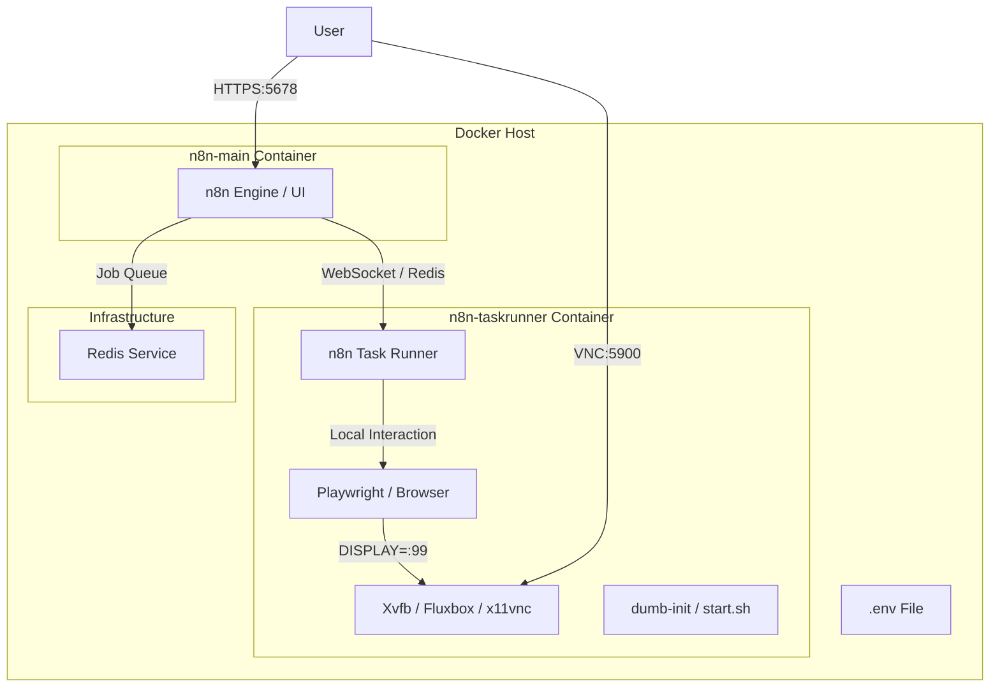

# Design Document: n8n-playwright-vnc-docker

## Overview
この設計書は、n8n公式のベストプラクティスに基づき、n8n本体とCodeノード実行環境（Task Runner）を分離したDocker構成を定義します。Playwrightによるブラウザ操作とVNCによる可視化をTask Runnerにオフロードすることで、システムの安定性とスケーラビリティを向上させます。

### Goals
- n8n本体と外部タスクランナー（External Task Runner）の分離 (1.1)
- Playwright、VNC、Xvfbを統合したカスタムTask Runnerイメージの作成 (1.2, 3.1, 4.1)
- Node.js 22.x 環境での実行 (2.3)
- Redisによるタスクキュー管理の維持 (1.1)

### Non-Goals
- 外部データベース（PostgreSQL等）への移行（現状はSQLiteを維持）
- 複数のワーカーによる水平スケーリングの詳細設計

## Architecture

### Architecture Pattern & Boundary Map

**Architecture Integration**:
- **Selected pattern**: External Task Runner Pattern (Sidecar Model).
- **Domain boundaries**: n8n-mainが管理とUIを担当し、n8n-taskrunnerがCodeノード（Playwright含む）の実行と描画を担当。
- **Steering compliance**: Playwright v1.40.0-jammy をベースに、公式の `n8nio/runners` 相当の機能を統合。

### Technology Stack

| Layer | Choice / Version | Role in Feature | Notes |
|-------|------------------|-----------------|-------|
| Runtime | Node.js 22.x | Engine execution | Main & Runner 両方で使用 |
| Orchestration | Docker Compose | Service management | 分離構成へ最適化 |
| Browser | Playwright 1.40.0 | Browser automation | Task Runner イメージに内蔵 |
| GUI Environment | Xvfb / Fluxbox | Virtual display & Window manager | Task Runner 内で動作 |
| VNC Server | x11vnc | Remote visualization | Task Runner の5900ポートで公開 |
| Queue | Redis 7-alpine | Task brokerage | n8n と Runner 間の通信用 |

## Requirements Traceability

| Requirement | Summary | Components | Interfaces | Flows |
|-------------|---------|------------|------------|-------|
| 1.1 | 最小限のサービス構成 | n8n-main, n8n-taskrunner, Redis | Docker Compose | Deployment |
| 1.2 | Single-stage Build | Unified Runner Dockerfile | build context | Build |
| 2.1 | n8n Webアクセス | n8n-main | Port 5678 | UI Access |
| 3.1 | Playwright実行環境 | n8n-taskrunner | Code Node API | Workflow Exec |
| 4.1 | VNC可視化 | n8n-taskrunner (GUI) | Port 5900 | Remote View |

## Components and Interfaces

### [Core Services]

#### n8n-main (Container)
| Field | Detail |
|-------|--------|
| Intent | ワークフロー管理、UI、トリガー実行を担うメインプロセス |
| Requirements | 1.1, 2.1, 2.3 |

**Responsibilities & Constraints**
- ユーザーインターフェースの提供
- ワークフローのスケジュール管理とトリガー実行
- 外部タスクランナーへの実行指示（WebSocket/Redis）

**Dependencies**
- Outbound: Redis (P0), n8n-taskrunner (P1)

#### n8n-taskrunner (Container)
| Field | Detail |
|-------|--------|
| Intent | Codeノードの実行、Playwright制御、GUI表示を担う実行環境 |
| Requirements | 1.1, 1.2, 3.1, 4.1 |

**Responsibilities & Constraints**
- Codeノード（JavaScript/Python）の安全な実行
- Playwrightによるブラウザ制御（Headed/Headless）
- 仮想ディスプレイ（Xvfb）およびVNCサーバーの提供

**Dependencies**
- Inbound: n8n-main (P0), VNC Client (P2)
- Internal: Playwright, Xvfb, fluxbox, x11vnc

**Contracts**: Service [x] / API [x] / State [ ]

##### Service Interface
- `N8N_RUNNERS_MODE=external`: 外部モードでの動作指定。
- `DISPLAY=:99`: コンテナ内プロセス間で共有されるディスプレイ環境。

**Implementation Notes**
- `Dockerfile.taskrunner` をベースに構築。
- `start.sh` で GUI 環境をセットアップした後、`n8n-taskrunner` プロセスを起動。

## Error Handling

### Error Strategy
- タスクタイムアウト: `N8N_RUNNERS_TASK_TIMEOUT` により、ハングしたブラウザプロセスを自動強制終了。
- プロセス分離: Task Runnerがクラッシュしても、n8n-mainのUI操作や他のワークフロー実行は継続。

## Testing Strategy
- **Integration Tests**: n8n-main から Code ノード経由で n8n-taskrunner 上の Playwright が正常に呼び出されることを確認。
- **Visualization Tests**: VNC クライアントから接続し、ブラウザの起動画面がリアルタイムで表示されることを確認。
